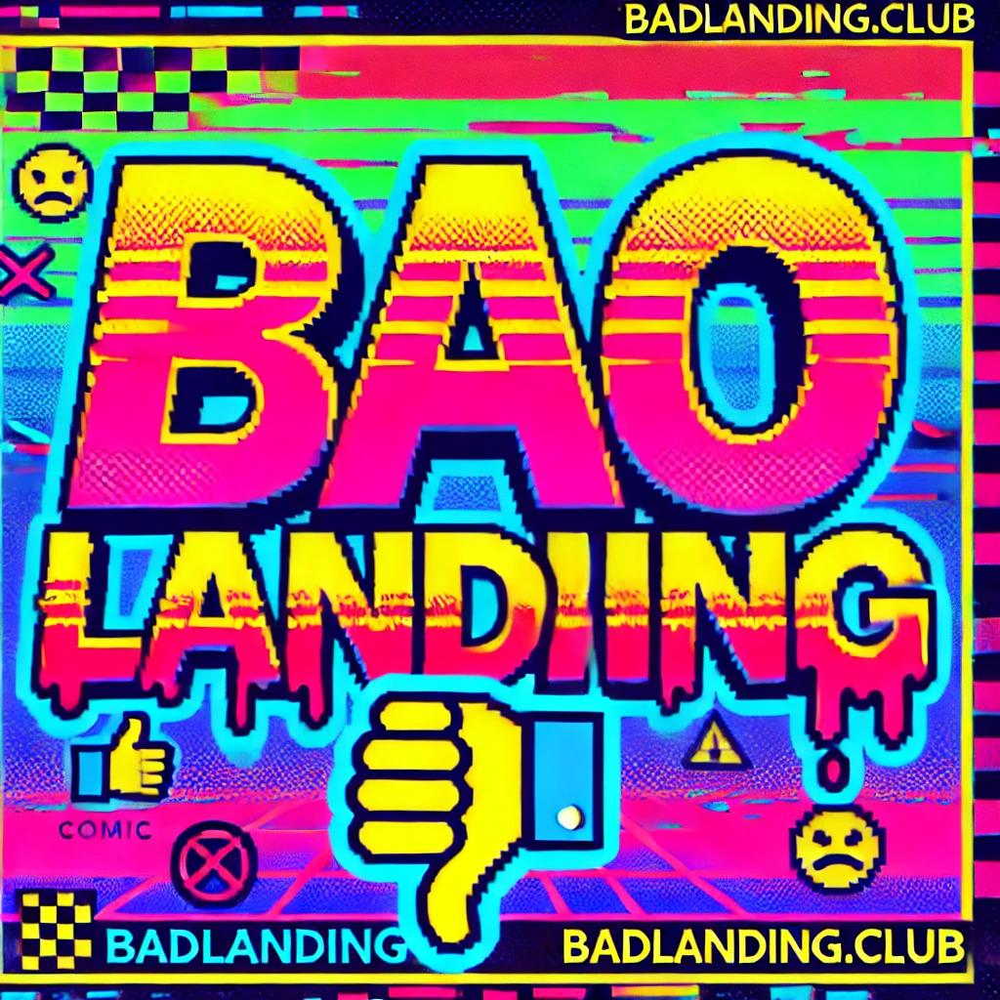

# 📉 BadLanding.club - The Worst Landing Page Ever!  

👎 **Welcome to the internet’s most useless landing page!** 👎 

This is a deliberately **horrible** website designed to confuse, disappoint, and amuse.  
There's **nothing useful here**, but you’ll probably click stuff anyway. **Enjoy your regret.** 😂  

🚀 **Live Demo**: [badlanding.club](https://badlanding.club) *(if you dare!)*  

---

## ❌ Features (or Lack of Them)  
✅ Ugly design with **Comic Sans & clashing colors**  
✅ A button that **does absolutely nothing useful**  
✅ Random **fake surprises** (that are NOT surprises at all)  
✅ Completely **SEO-unfriendly** (but somehow still ranks)  
✅ Possible **AdSense & Affiliate monetization** (because why not?)  

---

## 💰 Why Does This Exist?  
- To make people laugh at bad web design.  
- To generate **passive income** from ads & affiliate links.  
- To prove that even **a dumb website** can make money.  

---

## 🛠️ How to Set It Up (If You Also Want a Bad Landing Page)  
1. **Fork this repo** 🍴 
2. **Enable GitHub Pages** 🛜  
3. **Add your own nonsense** ✏️  
4. **Profit?** 💸 (Maybe...)  

---

## 🎨 Logo  
  

*(Yes, it’s intentionally ugly.)*  

---

🤣 **Star this repo if this made you laugh!** 🌟 Or fork it and create your own **awful** website! 🚀  

📝 *This README was AI-generated, because even writing a bad repo description was too much effort.* 🤖  
